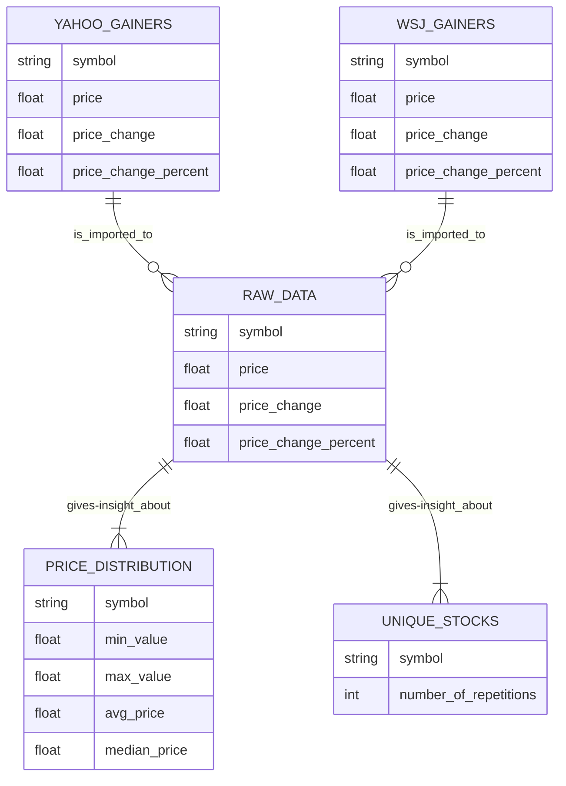

# LAB8: Database Design

# Introduction
This report presents the structure of the database developed for our project. The dataset comprises stock information of gainer stocks, collected three times daily over a period of five days during April 2025. The resulting database tables are designed to support analytical queries and facilitate insightful data analysis.

# Use Cases

## Case 1: Price Distribution
To gain insights into the price behavior of gainer stocks, we compute key statistical measures such as minimum, average, median, and maximum prices recorded while the stocks were on the gainer list. This information is captured in the `Price_Distribution` table.

## Use Case 2: Frequency of Appearance on the Gainer List
Understanding the consistency of a stock's appearance on the gainer list can reveal patterns of sustained growth versus isolated spikes. Is a stock steadily increasing in value, or is it experiencing a brief surge? The `Unique_Stocks` table addresses this by listing each stock along with the number of times it appeared on the gainer list.

# Methods

## Recollection
The data was collected on an Ubuntu system using a scheduled task defined in a crontab file. This setup utilized a Makefile to automate the download of HTML content from the Wall Street Journal and Yahoo Finance websites, using the Headless Chrome browser.

## Cleaning and Processing
The collected HTML content was cleaned and transformed into CSV format. To ensure consistency across sources, the data was normalized so that both the Wall Street Journal and Yahoo datasets shared a common schema. This step was performed using Python and the pandas library.

## Data Importation
The normalized CSV files were uploaded from the Ubuntu system to a cloud-based Snowflake database. This is achieved using DBT-core in combination with DBT-Snowflake, allowing the data to be uploaded in a clear and manageable way.

# Conclusion
The Entity-Relationship (ER) diagram below illustrates the structure of our database, which is designed to provide deeper insights into stock data. At this stage, the data is limited to gainer lists sourced from the Wall Street Journal and Yahoo Finance. However, the design allows for future expansion to include a broader range of stocks from the overall market.

